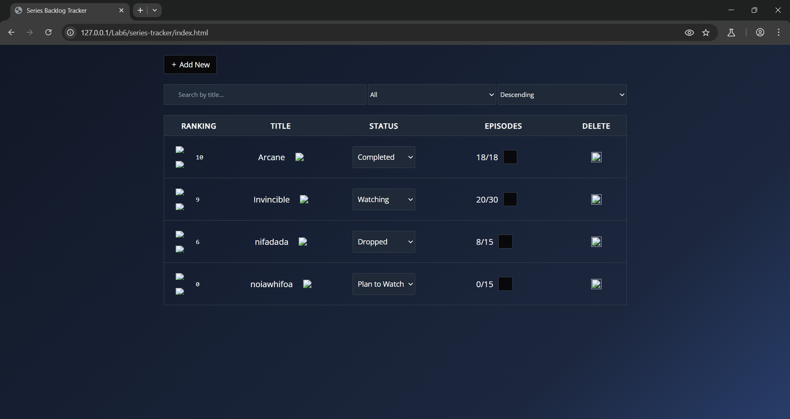

Para correr el programa y ver bien los íconos del front, se recomienda iniciar un server estando en el directorio de "series-tracker", contenido dentro de la carpeta donde se encuentra este documento.

Para correr la base de datos, se debe de ejecutar los siguientes comandos:
1. docker build 
2. 

Para correr el backend, se deben de ejecutar los siguientes comandos:
1. sudo go build 
2. sudo go run .

