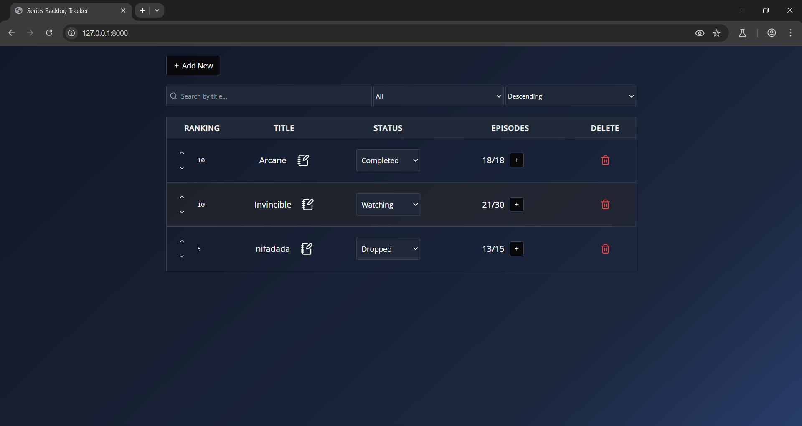

# Laboratorio 6, backend only
## Este es un lab para aprender de APIs. Hice lo que pude :D.
Para correr el programa y ver bien los íconos del front, se recomienda iniciar un server estando en el directorio de "series-tracker", contenido dentro de la carpeta donde se encuentra este documento.
Para iniciar ese server, ejecutar `python3 -m http.server 8000`. Entonces, entrar a 127.0.0.1:8000 en un navegador web.

Para correr la **base de datos**, se debe de ejecutar los siguientes comandos, estando dentro de la carpeta 'BD':
1. `docker build -t lab6_bd .`
2. `docker run -p 3306:3306  --name lab6 lab6_bd`

Y se ejecutará el dockerfile, iniciando así la base de datos en Mariadb.
### (Opcional) Si se quiere ver el contenido de la bd, ejecutar: 
1. `docker exec -it lab6 bash`
2. `mariadb -p -e "SELECT * FROM lab6db.series;"`
#### Pedirá la contraseña y, tal como se ve en el dockerfile, esta es 'root_password'

Para correr el **backend**, se deben de ejecutar los siguientes comandos, estando dentro de la carpeta 'backend':
1. `go build` 
2. `go run .`

Esto se realizó de esta manera, y no con docker, pues fue recomendación del catedrático descargar Go.

Así, el backend escucha a la BD desde el puerto 3306, y envía la señal al 8080, el cual es escuchado por el frontend, tal como pedía las instrucciones. 
